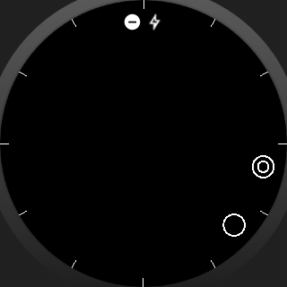
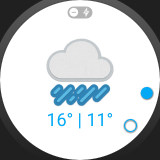
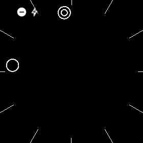
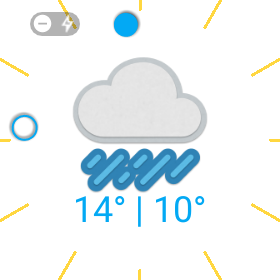
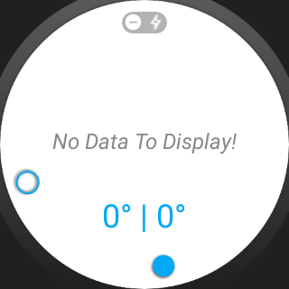

#Udacity-GoUbiquitous

Submission for sixth project on Udacity's Android Developer NanoDegree, "Go Ubiquitous".

###Overview

In accordance with and in addition to the project rubric, this app:

* Offers separate Watch Face styles for square and round smartwatches with ambient and regular modes.
* Displays the current time with a solid circle, representing the hour hand, and stroked circle, representing minutes. In Ambient mode, the solid circle switch to a double-ringed circle to guard against screen burn in.
* Displays high and low temperatures for that day.
* Displays a central graphic indicating the current weather.
* Shows a special watch face for situations where the wearable cannot connect to the phone, or cannot otherwise retrieve data.

###Usage

Clone and build the app as usual. For the "wearable" module, it will be necessary to edit the configuration such that **Launch Options** is set to **Nothing** rather than **Default Activity**

Create `gradle.properties` file, and add WeatherApiKey in the "MyOpenWeatherMapApiKey" field.

------------------------------------

Advanced Android Sample App
===================================

Synchronizes weather information from OpenWeatherMap on Android Phones and Tablets. Used in the Udacity Advanced Android course.

Pre-requisites
--------------
Android SDK 21 or Higher
Build Tools version 21.1.2
Android Support AppCompat 22.2.0
Android Support Annotations 22.2.0
Android Support GridLayout 22.2.0
Android Support CardView 22.2.0
Android Support Design 22.2.0
Android Support RecyclerView 22.2.0
Google Play Services GCM 7.0.0
BumpTech Glide 3.5.2

Getting Started
---------------
This sample uses the Gradle build system.  To build this project, use the
"gradlew build" command or use "Import Project" in Android Studio.

Support
-------

- Google+ Community: https://plus.google.com/communities/105153134372062985968
- Stack Overflow: http://stackoverflow.com/questions/tagged/android

Patches are encouraged, and may be submitted by forking this project and
submitting a pull request through GitHub. Please see CONTRIBUTING.md for more details.

License
-------
Copyright 2015 The Android Open Source Project, Inc.

Licensed to the Apache Software Foundation (ASF) under one or more contributor
license agreements.  See the NOTICE file distributed with this work for
additional information regarding copyright ownership.  The ASF licenses this
file to you under the Apache License, Version 2.0 (the "License"); you may not
use this file except in compliance with the License.  You may obtain a copy of
the License at

http://www.apache.org/licenses/LICENSE-2.0

Unless required by applicable law or agreed to in writing, software
distributed under the License is distributed on an "AS IS" BASIS, WITHOUT
WARRANTIES OR CONDITIONS OF ANY KIND, either express or implied.  See the
License for the specific language governing permissions and limitations under
the License.

